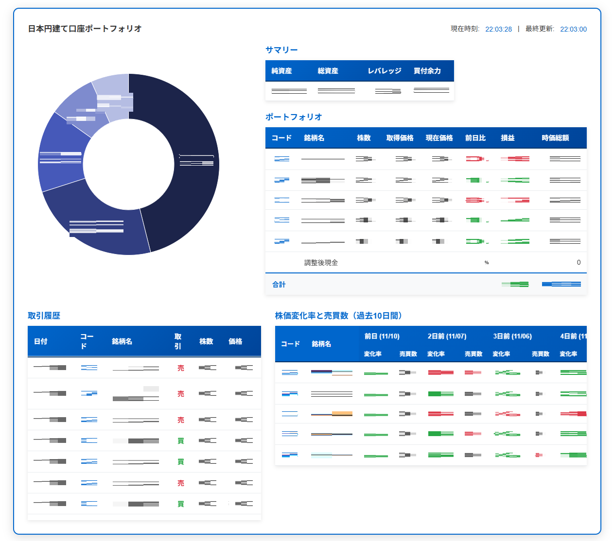

# SBI 証券用 Chrome 拡張機能



## プロジェクト概要

このリポジトリは SBI 証券の HP で動作する Google Chrome 拡張機能を開発するためのものです。
具体的には、ポートフォリオ、取引履歴、価格推移などを取得し、優れた UI で表示することを目的としています。
Manifest V3 に準拠し、サービスワーカーを使用してバックグラウンドで処理を実行します。

- [Preact](https://preactjs.com/?lang=ja)
- [Chart.js](https://www.chartjs.org/)
- [Tailwind CSS](https://tailwindcss.com/)

### プロジェクト構造

```text
sbiChromeExtention/
├── manifest.json               # 拡張機能の設定ファイル（Manifest V3）
├── background/
│   └── serviceWorker.js        # バックグラウンド処理用サービスワーカー、データの取得担当
├── content/
│   ├── components/             # Preactコンポーネント
│   ├── modules/                # ロジックモジュール
│   ├── utils/                  # ユーティリティ (Preactアダプター等)
│   ├── contentScript.js        # エントリーポイント
│   └── contentStyles.css       # スタイル定義
├── icons/                      # 拡張機能のアイコン
├── libs/                       # ライブラリ (Preact, htm, Chart.js)
└── init.js                     # ES Modules読み込み用ローダー
```

## テクノロジー

- **Manifest V3**: 最新の Chrome 拡張機能仕様に準拠
- **Preact + HTM**: ビルドツールなしで React ライクなコンポーネント開発を実現
- **Chart.js**: ポートフォリオの可視化

## 主要機能

### ポートフォリオデータ取得

- SBI 証券のポートフォリオページから総評価額、評価損益、保有銘柄を自動抽出
- 円建て口座に加え、外貨建て口座情報の取得と合算表示 (円グラフ、サマリー) に対応
- `content/contentScript.js` で実装
- 一部機能は個人の株式情報サーバー [InvestSupporter](https://github.com/root-5/InvestSupporter) を利用

### リアルタイム更新

- バックグラウンドで定期的にデータを更新
- `background/serviceWorker.js` で管理

### 改良された UI

- ポップアップウィンドウでポートフォリオサマリーを表示
- ページ上に拡張された情報パネルを追加

## デバッグ方法

1. サービスワーカーのデバッグ
   chrome://extensions/ → 拡張機能の詳細 → サービスワーカー → 検査

2. コンテンツスクリプトのデバッグ
   SBI 証券のページで F12 → Console タブでログを確認

3. ポップアップのデバッグ
   拡張機能アイコンを右クリック → 検査

## 今後の拡張予定

- [x] 基本的なファイル構造の作成
- [x] SBI 証券データ抽出の実装
- [x] アイコンの適用
- [x] 取引履歴の取得・表示
- [x] 外貨建て口座対応
- [ ] データエクスポート機能
- [ ] バックエンドへデータ送信、記録

## ライセンス

このプロジェクトは個人利用目的で開発されています。
SBI 証券の利用規約を遵守して、自己責任で使用してください。
